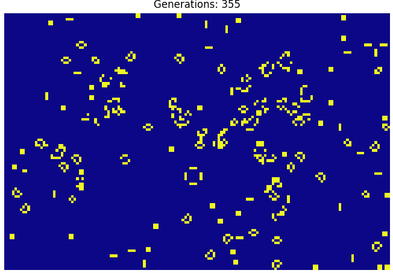

 <h2 align="center">  Hey there! I'm Juan</h2>

<!--  -->
<!--  -->
<!--  -->

## 🧠 &nbsp; About Me

I'm a **problem solver** who uses programming, ML, and data-driven solutions. I don't limit myself to specific roles or tools—I focus on solving problems and learning whatever is needed along the way.

## 💼 &nbsp; Experience

🚀 **Data Scientist @ Rappi** (Payment & Fraud)
- 🛡️ Reducing document fraud with ML models
- 👤 Building face anti-spoofing systems
- 📝 Developing OCR with MRZ technology
- 🔄 End-to-end ML lifecycle management

🏗️ **Computer Vision Engineer @ Inference SAS**
- Deep learning for sewer inspection systems

📊 **Data Analyst @ Universidad Nacional de Colombia**
- Dashboard creation with Looker Studio

🎓 **Education**: Master's in Engineering (AI focus)

## 🛠️ &nbsp; Tech Stack

### 💻 Programming & Data

### 🧠 ML & AI

### 📊 Visualization

### 🚀 MLOps & Deployment

### 🔄 Version Control

### 🏷️ Data Tools

### 💻 Dev Environment

## 📚 &nbsp; Learning

## 🚀 &nbsp; Projects
<table align="center">
 <tr>
   <td>
      

        <a href="https://github.com/optilab-mzl/dataton2023-optilab">
          
           <strong>Optilab</strong>
        </a>
      

    </td>
 <td>
      

        <a href="https://github.com/AHirigoyen/CountTrees">
          
           <strong>CountTrees</strong>
        </a>
      

    </td>
   <td>
      

        <a href="https://github.com/aguirrejuan/job-recommendation-system">
          
           <strong>Job Recomendation System</strong>
        </a>
      

    </td>
  </tr>
 <tr>
  <tr>
    <td>
      

        <a href="https://github.com/UN-GCPDS/python-gcpds.image_segmentation">
          
           <strong>Image Segmentation Library</strong>
        </a>
      

    </td>
    <td>
      

        <a href="https://github.com/UN-GCPDS/FEET-GUI">
          
           <strong>Feet GUI</strong>
        </a>
      

    </td>
   <td>
      

        <a href="https://github.com/jvech/DeepSort_Yolo">
          
           <strong>Person Tracking TradeNet</strong>
        </a>
      

    </td>
  </tr>
 
<td>
      

        <a href="https://github.com/aguirrejuan/conwaysGameOfLife">
          
           <strong>Conway's Game of Life</strong>
        </a>
      

    </td>
 <td>
      

        <a href="https://github.com/UN-GCPDS/Procesamiento-Digital-De-Imagenes">
          
           <strong>Curso Procesamiento Digital de Imágenes</strong>
        </a>
      

    </td>
</tr>
</table>

## ⚙️ &nbsp;GitHub Stats

  
  

  

